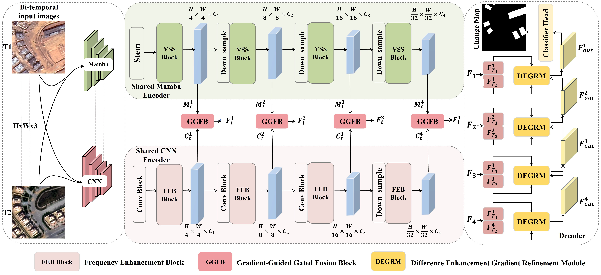

# FGPMamba: Frequency-Geometry Prior-Guided Mamba for Building Change Detection

This is the official repository for **FGPMamba** and **ADEC-CD**, a high-resolution building change detection dataset covering Egypt’s New Administrative Capital. 
For more information, please see our published paper at [International Journal of Applied Earth Observation and Geoinformation](https://ieeexplore.ieee.org/document/11573068).

# FGPMamba code
FGPMamba Link: https://github.com/zjd1836/FGPMamba/blob/main/FGPMamba.py

## ADEC-CD Dataset

ADEC-CD is a binary building change detection dataset constructed from bitemporal SuperView-2 optical imagery acquired in 2018 and 2024 over Egypt’s New Administrative Capital. The dataset focuses on large-scale construction monitoring in arid emerging-city environments, where changed buildings may be confused with bare land, concrete surfaces, roads, shadows, construction materials, and unfinished structures.

### Dataset characteristics

* **Study area:** Egypt’s New Administrative Capital and adjacent development areas
* **Acquisition years:** 2018 and 2024
* **Spatial resolution:** 0.5 m
* **Image size:** 256 × 256 pixels
* **Task:** Binary building change detection
* **Number of bitemporal image pairs:** 16,236
* **Training set:** 12,614 pairs
* **Validation set:** 1,381 pairs
* **Test set:** 2,241 pairs
* **Partition protocol:** Geographically independent multi-zone split

The dataset includes representative construction situations such as newly completed buildings, identifiable under-construction buildings, incremental renewal within built-up areas, and building demolition. These situations are descriptive rather than independent semantic classes; all annotations use binary changed-building labels.

The training, validation, and test subsets correspond to the fixed geographic partition used in the manuscript. Spatially coherent validation and test zones are separated from the training areas to reduce spatial leakage.

## Download

The complete cropped and partitioned ADEC-CD dataset can be downloaded from Baidu Netdisk:

* **File:** `ADEC-CD.zip`
* **Download link:** https://pan.baidu.com/s/1SvVkiGLo62jWUAOsfXTkDA?pwd=c61m
* **Extraction code:** `c61m`

Please retain the provided training, validation, and test partitions when reproducing the results reported in the manuscript.

## License and Intended Use

ADEC-CD is released for non-commercial academic research and educational use. Users may use the dataset for research, comparison, and reproducibility studies provided that the dataset source and the corresponding paper are properly acknowledged.
Redistribution of modified versions, incorporation into commercial products, or commercial use requires prior permission from the dataset authors. Users are responsible for ensuring that their use of the dataset complies with applicable laws and institutional requirements.

A separate license file will be provided in this repository.

# Citation
If you use this code or dataset for your research, please cite our paper:  

J. Zhang et al., "S3Mamba: A Scale-Aware Spatial-Spectral Mamba for Building Change Detection in Ultra-High-Resolution UAV Imagery," in IEEE Transactions on Geoscience and Remote Sensing, doi: 10.1109/TGRS.2026.3705637.

or

@ARTICLE{11573068,
  author={Zhang, Jindou and Wang, Zihan and Xiao, Xiongwu and Zhang, Zhizheng and Zhang, Yongle and Chen, Yunong and Hu, Yaofeng and Shao, Zhenfeng and Li, Deren and Konecny, Milan},
  journal={IEEE Transactions on Geoscience and Remote Sensing}, 
  title={S3Mamba: A Scale-Aware Spatial-Spectral Mamba for Building Change Detection in Ultra-High-Resolution UAV Imagery}, 
  year={2026},
  doi={10.1109/TGRS.2026.3705637}}
